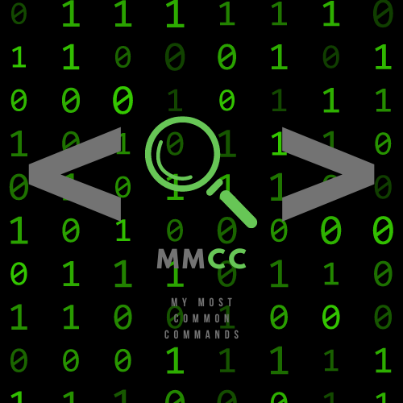

	

 

## What does this do?
> MMCC just shows you your top 3 most used commands in your shell (determined by `$SHELL`) and how many times they've been used.
> 

## Wanna use it?
> 1) Install [cx-Freeze](https://pypi.org/project/cx-Freeze/): `pip install cx-Freeze`
> 2) Clone this repository.
> 3) Run `make` and add the path to the generated `bin` folder to `$PATH` (`~/path-to/mmcc/bin`).
>
> Now run `mmcc` and enjoy knowing what commands you use ~~too much~~ the most!

## Note:
> This program works best on Linux and MacOS. Although it *will* work on Windows, from my testing, it's a little bit iffy. But, it works.
