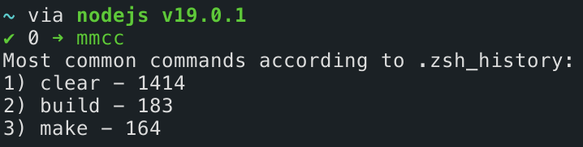

	<h1>MMCC</h1>
	
My Most Common Commands

## What does this do?
> MMCC just shows you your top 3 most used commands in your shell (determined by `$SHELL`) and how many times they've been used.
> 

## Wanna use it?
> Install [cx-Freeze](https://pypi.org/project/cx-Freeze/): `pip install cx-Freeze`
> Just run `make` and add the path to the generated `bin` folder to `$PATH`.
> Now run `mmcc` and enjoy knowing what commands you use ~~too much~~ the most!
