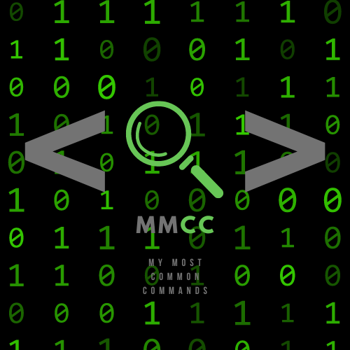
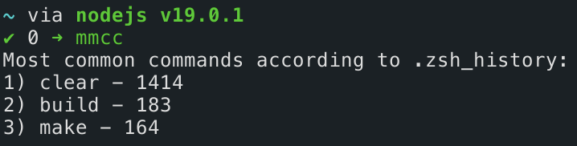

	

 

## What does this do?
> MMCC just shows you your top 3 most used commands in your shell (determined by `$SHELL`) and how many times they've been used.
> 
> **NOTE**: Only [bash](https://www.gnu.org/software/bash/), [zsh](https://www.zsh.org/), and [fish](https://fishshell.com/) are supported.

## Wanna use it?
> 1) Clone the repo.
> 2) Run `make`.
>
> Now run `mmcc` and enjoy knowing what commands you use ~~too much~~ the most!

## Note:
> I am still learning C, I am by no means an expert. I wrote this on Ubuntu Cinnamon, so I don't know if it'd run on MacOS, and I'm sure it won't run on Windows.
